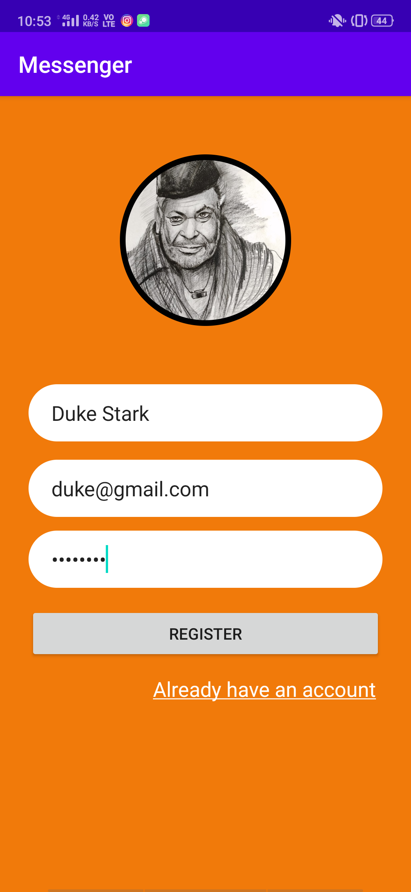
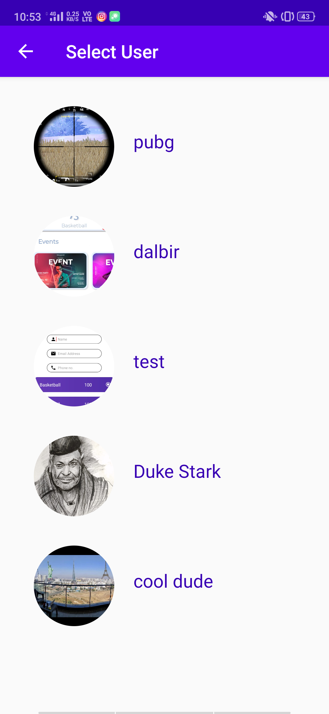

# Messenger
Application to share messages using Firebase

## Screenshots
    

## What it includes?
It is a simple application to register/login users into the application, so as to send/receive messages and images from all the registered users.

#### What users can send ?
- Text Messages
- Images

#### Libraries Used
- implementation "com.xwray:groupie:2.1.0"
- implementation 'com.github.felixsoares:ImageZoom:1.0'
- implementation 'de.hdodenhof:circleimageview:3.1.0'
- implementation 'com.squareup.picasso:picasso:2.71828'

